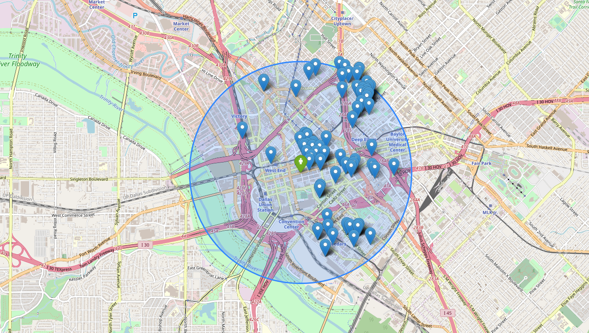

# Homework 3 - Find the perfect place to stay in Texas!

<p align="center">

</p>

The homework consists in analyzing the text of Airbnb property listings and building a search engine.

____

# VERY VERY IMPORTANT
__!!!Read the entire homework before coding anything!!!__

____
## Step 1: Data
* Download the [data](https://www.kaggle.com/PromptCloudHQ/airbnb-property-data-from-texas).

____

## Step 2: Create documents
* Dealing with different files it's an important task in Data Mining. For this purpose, create a `.tsv` file for each record of the dataset. The content of the file should be the following:

    ```
    average_rate_per_night \t  bedrooms_count \t city \t date_of_listing \t description \t latitude\t longitude \t title \t url
    ```
   
    __Example__:
  
    ```
    20$      4       Humble     May 2016        stylish and beautiful apartment etc etc..      40.2        17.02       River house        www.airbnb.com/19281 
    ```
   
__Note__ that in a .tsv file, each column is separated by the `tab`.
* Store the documents in a directory with inside one file per house review. You should name each file as `doc_i.tsv` where `i` is the dataframe index the document.
   
____

## Step 3: Search Engine

Now, we want to create two different Search Engines that, given as input a query, return the houses that match the query.

As a first common step, you must preprocess the documents by

1. Removing stopwords
2. Removing punctuation
3. Stemming
4. Anything else you think it's needed

For this purpose, you can use the [nltk library](https://www.nltk.org/).

### 3.1) Conjunctive query
At this moment, we narrow out interest on the `description` and `title` of each document. It means that the first Search Engine will evaluate queries with respect to the aforementioned information.

#### 3.1.1) Create your index!

Before building the index, be sure you have a file named `vocabulary`, in the format you prefer, that maps each word to an integer (`term_id`).
Then, the first brick of your homework is to create the Inverted Index. It will be a dictionary of this format:

```
{
term_id_1:[document_1, document_2, document_4],
term_id_2:[document_1, document_3, document_5, document_6],
...}
```

where _document\_i_ is the *id* of a document that contains the word.

__Hint:__ Since you do not want to compute the inverted index every time you use the Search Engine, it is worth to think to store it in a separate file and load it in memory when needed.

#### 3.1.2) Execute the query
Given a query, that you let the user enter:

```
a beautiful house with garden and beach
```
the Search Engine is supposed to return a list of documents.

##### What documents do we want?
Since we are dealing with conjunctive queries (AND), each of the returned documents should contain all the words in the query.
The final output of the query must return, if present, the following information for each of the selected documents:

* Title
* Description
* City
* Url

__Example Output__:

|                        Title                       |                                                                                                 Description                                                                                                 |     City    |                                 Url                                 |
|:--------------------------------------------------:|:-----------------------------------------------------------------------------------------------------------------------------------------------------------------------------------------------------------:|:-----------:|:-------------------------------------------------------------------:|
|   2 Private rooms/bathroom 10min from IAH airport  | Welcome to stay in private room with queen bed and detached private bathroom on the second floor. Another private bedroom with sofa bed is available for additional guests. 10$ for an additional guest.... |    Humble   |   https://www.airbnb.com/rooms/18520444?location=Cleveland%2C%20TX  |
| Unique Location! Alamo Heights - Designer Inspired | Stylish, fully remodeled home in upscale NW – Alamo Heights Area. \n\nAmazing location - House conveniently located in quiet street, with beautiful seasoned trees, prestigious neighborhood and very cl... | San Antonio |    https://www.airbnb.com/rooms/17481455?location=Cibolo%2C%20TX    |
|              River house near the city             |                                 'River house on island close to the city' \nA well maintained river house off the San Jacinto river with extra room for temporary visitors.                                 |   Houston   | https://www.airbnb.com/rooms/16926307?location=Beach%20City%2C%20TX |

If everything works well in this step, you can go straight to the next point, and make your Search Engine more complex and better in answering queries.

### 3.2) Conjunctive query & Ranking score
In the new Search Engine, given a query, we want to get the *top-k* (the choice of *k* it's up to you!) documents related to the query. In particular:

* Find all the documents that contains all the words in the query (as before...).
* Sort them by their similarity with the query
* Return in output *k* documents, or all the documents with non-zero similarity with the query when the results are less than _k_. You __must__ use a heap data structure (you can use Python libraries) for maintaining the *top-k* documents.

Note that there is a difference from this and what we did in the class. Here we are asking to return documents that contain __all__ the query terms.

To solve this task, you will have to use the *tfIdf* score, and the _Cosine similarity_. Let's see how.

#### 3.2.1) Inverted index
Your second Inverted Index must be of this format:

```
{
term_id_1:[(document1, tfIdf_{term,document1}), (document2, tfIdf_{term,document2}), (document4, tfIdf_{term,document4}), ...],
term_id_2:[(document1, tfIdf_{term,document1}), (document3, tfIdf_{term,document3}), (document5, tfIdf_{term,document5}), (document6, tfIdf_{term,document6}), ...],
...}
```

Practically, for each word you want the list of documents in which it is contained in, and the relative *tfIdf* score.
__Tip__: *tfIdf* values are invariant with respect to the query, for this reason you can precalculate them.

#### 3.2.2) Execute the query

Once you get the right set of documents, we want to know which are the most similar according to the query. For this purpose, as scoring function we will use the Cosine Similarity with respect to the *tfIdf* representations of the documents.

Given a query, that you let the user enter:
```
a beautiful house with garden and beach
```
the Search Engine is supposed to return a list of documents, __ranked__ by their Cosine Similarity with respect to the query entered in input.

More precisely, the output must contain:
* Title
* Description
* City
* Url
* The similarity score of the documents with respect to the query

__Example Output__:

|                        Title                       |                                                                                                 Description                                                                                                 |     City    |                                 Url                                 | Similarity |
|:--------------------------------------------------:|:-----------------------------------------------------------------------------------------------------------------------------------------------------------------------------------------------------------:|:-----------:|:-------------------------------------------------------------------:|:----------:|
|   2 Private rooms/bathroom 10min from IAH airport  | Welcome to stay in private room with queen bed and detached private bathroom on the second floor. Another private bedroom with sofa bed is available for additional guests. 10$ for an additional guest.... |    Humble   |   https://www.airbnb.com/rooms/18520444?location=Cleveland%2C%20TX  |    0.96    |
| Unique Location! Alamo Heights - Designer Inspired | Stylish, fully remodeled home in upscale NW – Alamo Heights Area. \n\nAmazing location - House conveniently located in quiet street, with beautiful seasoned trees, prestigious neighborhood and very cl... | San Antonio |    https://www.airbnb.com/rooms/17481455?location=Cibolo%2C%20TX    |    0.92    |
|              River house near the city             |                                 'River house on island close to the city' \nA well maintained river house off the San Jacinto river with extra room for temporary visitors.                                 |   Houston   | https://www.airbnb.com/rooms/16926307?location=Beach%20City%2C%20TX |    0.87    |

__To perform the different types of queries, you should use the algorithm that was explained in class.__

____

## Step 4: Define a new score!

Now it's your turn. Suppose that Airbnb wants you in their team, but they need the best idea ever on how to rank the houses based on the queries of their users.

In this scenario, a single user can give in input more information than the single textual query, so you need to take into account all this informations, and think a creative and logical way on how to answer at user's requests.

Practically:

1. The user will give you for sure a text query. As a starting point, get the query-related documents by exploiting the search engine of Step 3.1.
2. Once you have the documents, you need to sort them according to your new score. In this step you won't have anymore to take into account the `title` and `description` of the documents, you __must__ use only the remaining variables in your dataset (or new possible variables that you can create from the existing ones...). You __must__ use a heap data structure (you can use Python libraries) for maintaining the *top-k* documents.

    > __Q:__ How to sort them?
    __A:__ Allow the user to specify more information, that you find in the documents, and define a new metric that ranks the results based on the new request.
   
__N.B.:__ You have to define a __scoring function__, not a filter! 

The output, must contain:

* Title
* Description
* City
* Location

__Example Output__:

| Ranking |                        Title                       |                                                                                                 Description                                                                                                 |     City    |                                 Url                                 |
|:--------:|:--------------------------------------------------:|:-----------------------------------------------------------------------------------------------------------------------------------------------------------------------------------------------------------:|:-----------:|:-------------------------------------------------------------------:|
|     1    |   2 Private rooms/bathroom 10min from IAH airport  | Welcome to stay in private room with queen bed and detached private bathroom on the second floor. Another private bedroom with sofa bed is available for additional guests. 10$ for an additional guest.... |    Humble   |   https://www.airbnb.com/rooms/18520444?location=Cleveland%2C%20TX  |
|     2    | Unique Location! Alamo Heights - Designer Inspired | Stylish, fully remodeled home in upscale NW – Alamo Heights Area. \n\nAmazing location - House conveniently located in quiet street, with beautiful seasoned trees, prestigious neighborhood and very cl... | San Antonio |    https://www.airbnb.com/rooms/17481455?location=Cibolo%2C%20TX    |
|     3    |              River house near the city             |                                 'River house on island close to the city' \nA well maintained river house off the San Jacinto river with extra room for temporary visitors.                                 |   Houston   | https://www.airbnb.com/rooms/16926307?location=Beach%20City%2C%20TX |


Have fun and be creative. There is no correct way to rank these houses, but __justify clearly all of your choices.__

____


## Bonus Step: Make a nice visualization!

__IMPORTANT:__ This is a bonus step, thus it's not mandatory. You can get the maximum scoure also without doing this. We're taking into account this, only if the rest of the homework has been completed.

An important feature of Airbnb, it's the search on the map. Here we want to try to recreate a similar tool!

Our tool will works in the following way:

1. Takes in input a set of coordinates, e.g: [32.779594, -96.800768], and a maximum distance from the coordinates, e.g.: 10km.
2. Generate a map, with a circle of the given radius, where the center is represented by the coordinates given in input.
3. Shows the houses that are inside the circle of the given radius.

Here a small example, with all the houses far at most 2km from the 7-Eleven in Commerce St, Dallas:



In order to complete this task, you will find useful:

- [Folium - Marker for the map](https://python-visualization.github.io/folium/quickstart.html)
- [Geopy - Computing distance between 2 coordinates](https://geopy.readthedocs.io/en/stable/#module-geopy.distance)

The example shown it's quite basic, you can go deeper adding more and more features, or making the map even more clear and understandable!


<p align="center">

</p>


# Submit the homework

## When?
Homework 2 is due on [25th November 2018 - 23:59:59](http://aris.me/index.php/data-mining-ds-2018). Any homework submitted after the deadline will be subjected to a penalisation with the following schema:

|   Delay  | Penalisation |
|:--------:|:------------:|
|  1 day |     -0.5     |
| 2 days |      -1      |
| 3 days |      -2      |
| 4 days |      -3      |
| 5 days |      -4      |

If you have particular problems to respect the deadline, please contact Aris directly (putting @Cristina in cc) and explain your situation clearly mention your working group.

The maximum score you can get is 5.

## What?

The content of the repository is up to you. The mandatory files are:
* `README.md`: a Markdown file that explains the content of your repository. This is an [example](https://github.com/CriMenghini/Wikipedia/tree/master/Mention). It is important that for each file/folder you say what it contains. [Here](https://github.com/adam-p/markdown-here/wiki/Markdown-Cheatsheet) a cheatsheet to use Markdown.
* `Homework_3.ipynb`: a tidy Notebook where you put the code and the comments of your pipeline. Here an [example](https://github.com/CriMenghini/ADA_Homeworks/blob/master/Homework_2/Hw_2.ipynb) of what it should look like.
    - In general, for the sake of the tidiness of the Notebook, you are encouraged to save yout functions in external .py files that you [import](https://www.programiz.com/python-programming/modules) in the notebook.
    - Upload on GitHub the notebook with the cells already run
    - It might be possible that you do not see some plots. For this reason, we suggest you to put in the `README.md` a link that you create [here](http://nbviewer.jupyter.org/) just copying and paste the url of your notebook on GitHub.

It __must not__ contain:
* The datasets you used (thus you should clearly state in the readme what dataset you used, if any not in the homework description). That's because git allows you to push only dataset smaller of a max size. [Here](https://medium.com/@haydar_ai/learning-how-to-git-ignoring-files-and-folders-using-gitignore-177556afdbe3) a good Medium's post that tells you how to deal with files/directories you do not want to push on GitHub.


## Forms

- [Github Repository Form](https://docs.google.com/forms/d/1qHtj1DF_0iFzQsqZMPVi43t4_yqe6RofWk_dWlgAdSU/edit)
- Group Review Form [Available after the deadline]
- Peer Review Form [Available after the deadline]
